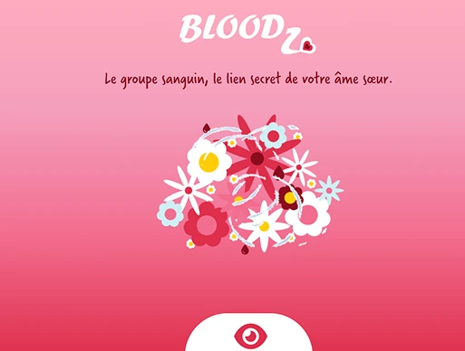
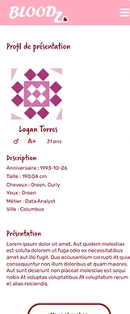

# BLOODZ

## 🌍 Contexte
<i>Ce projet personnel est né de ma volonté d'explorer le framework React en tant qu'autodidacte. BLOODZ est un site de rencontre fictif qui s'appuie sur les groupes sanguins comme critère de mise en relation. Le design du site, réalisé sur Adobe Xd, utilise des tons rouges et roses pour symboliser à la fois le sang et l'amour. Ce projet m'a permis de m'initier à la conception de sites dynamiques et de manipuler une API pour récupérer des données utilisateur.</i>

  
  

## 🎯 Objectifs
- Se former sur le **framework React**.
- S'initier à la conception d'un site **dynamique et responsive**.
- Essayer les **appels API** pour récupérer et exploiter des données.
  

## 💡 Technologies utilisées
- HTML5
- CSS3
- React
- Adobe Xd (réalisation du design)
  

## 🌱 Compétences développées
- **Conception** d'interfaces utilisateur en React.
- **Consommation d'API REST** pour récupérer des données.
- **Structuration** d'un projet web responsive en autonomie.
  

## 📂 Structure
📁 Bloodz 
│── 📁 public/  
│── 📁 src/  
│    └── 📁 assets/  
│    └── 📁 components/  
│    └── 📁 pages/  
│    └── App.js/  
│    └── App.test.js/  
│    └── index.js/  
│── README.md
  

## 💻 Démonstration en ligne
👉 Voir le site en ligne [ICI](https://helenec-cyber.github.io/Bloodz/)
  

## 📝 Notes additionnelles
- Outil utilisé pour la mise en place de l'environnement de développement : **Create React App** (Déprécié, priviligiez **Vite**)
- Ce projet, bien que non fonctionnel et simpliste, fait appel à une API gratuite (dummyjson.com/users) pour générer des utilisateurs fictifs sur le site. J'ai également pu expérimenter la logique des fonctions de filtrage pour affiner les résultats d'affichage.
  

## 📬 Contact
Pour toute question ou suggestion, n'hésitez pas à me contacter sur [LinkedIn](https://www.linkedin.com/in/helene-canovas-48710b141/)